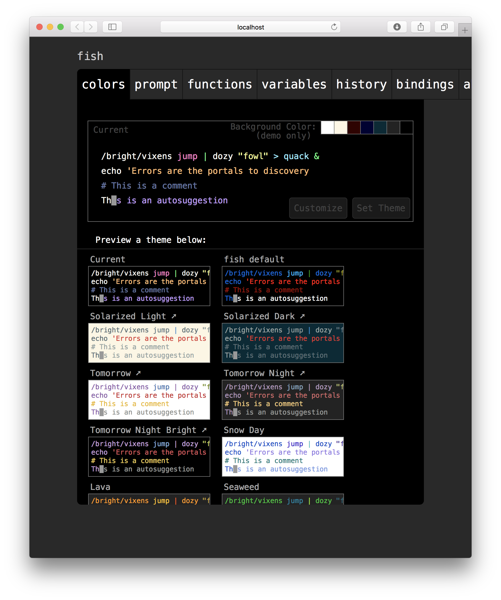
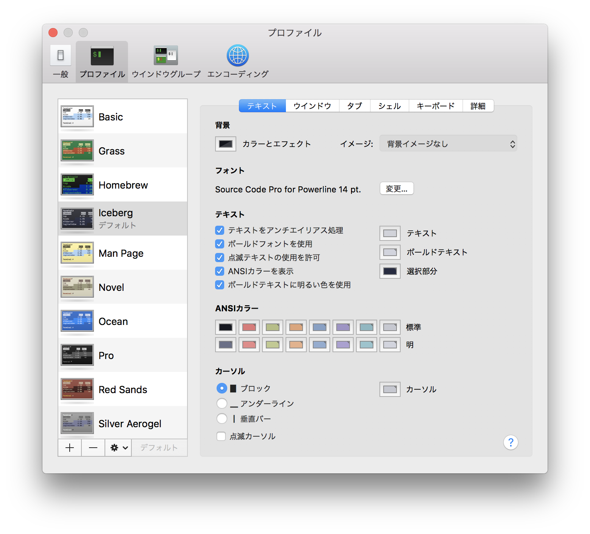
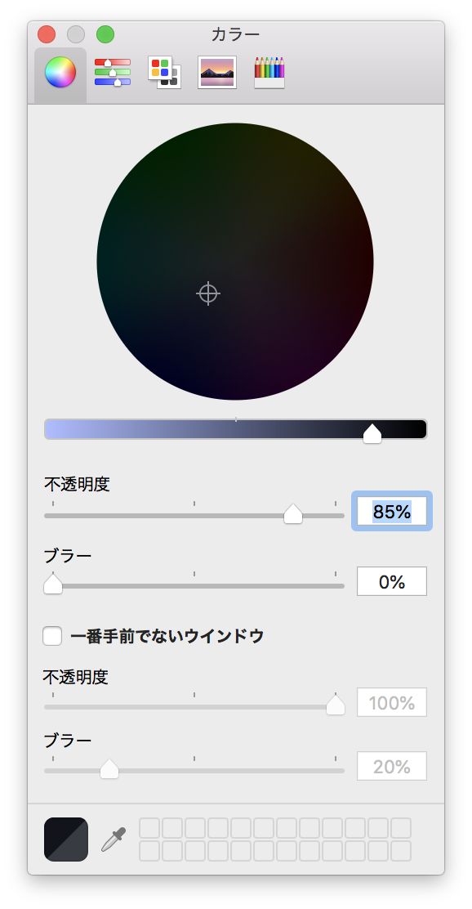
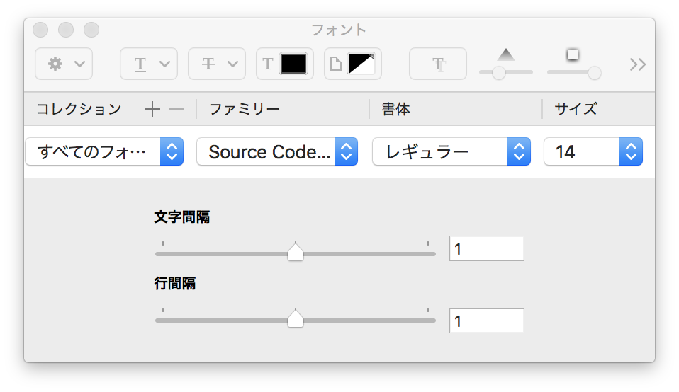
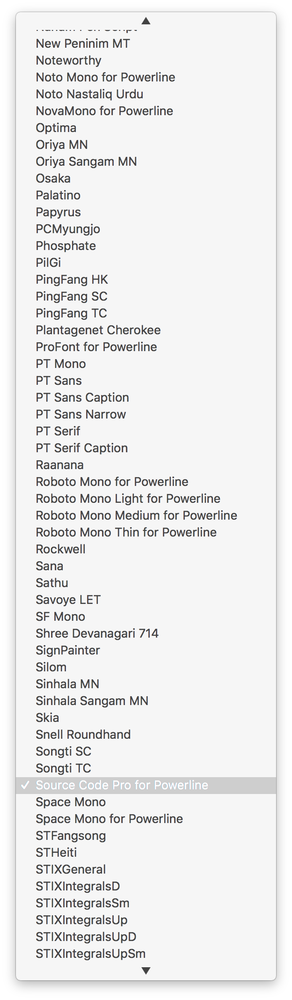

# dotfiles

Setup Mac OS.

## First of all

```bash
$ xcode-select --install
```

## Checkout

```bash
$ cd
$ git clone https://github.com/yukihira1992/dotfiles.git
```

## Install

```bash
$ cd ~/dotfiles
$ make setup-all
```

## Fish shell

### Change fish color

```bash
$ fish_config
```



Select theme and click "Set Theme" Button.

## Terminal

Start Terminal.app

Select "Terminal" -> "Preferences" -> "Profile".



### Change transparency

Click "Color and Effect".



### Change font

Click "Font"



Select "Family"



Select "Source Code Pro for Powerline"

